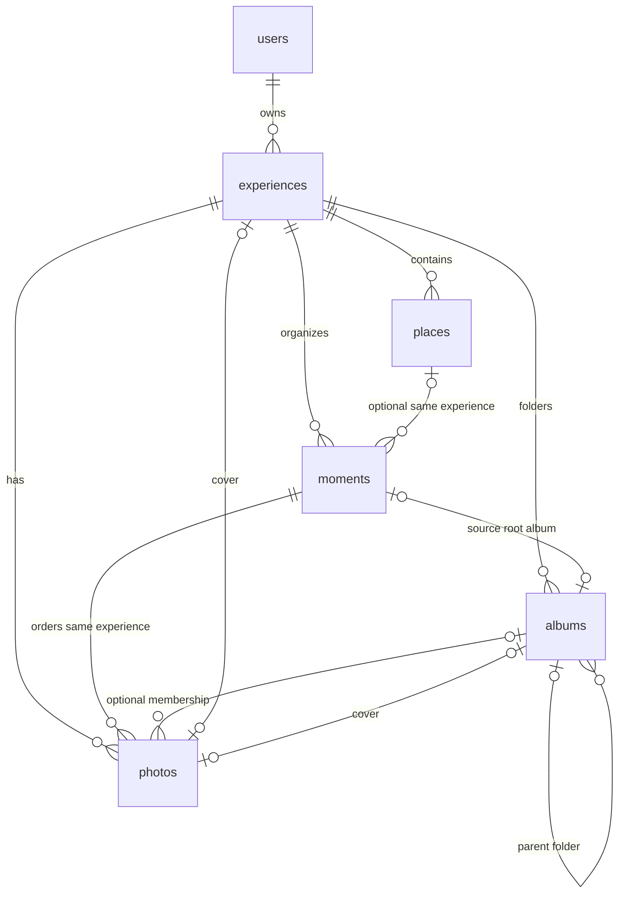

# Banco de dados

## Tecnologia

Supabase PostgreSQL gerenciado com PostGIS e Row Level Security obrigatória. Supabase Auth fornece identidade e sessões. Transações protegem publicação e edição; índices espaciais sustentam mapas e agrupamentos futuros. A API continua sendo a fronteira das operações privilegiadas.

Esta especificação traduz o modelo conceitual aprovado de **Experiência**. Não autoriza criação de tabelas, migrations, SQL executado, API, upload, R2, mapa, IA ou NFC.

## Nomenclatura

| Domínio (PT) | Tabela (EN) | Notas |
| --- | --- | --- |
| Usuário | `users` | Perfil; identidade vem do Auth |
| Experiência | `experiences` | Substitui o antigo conceito `memories` |
| Lugar | `places` | Identidade geográfica revisável |
| Momento | `moments` | Sessão/grupo ordenado; não é uma foto |
| Álbum | `albums` | Pasta/subpasta hierárquica dentro da experiência |
| Foto | `photos` | Foto confirmada na experiência |

Não existem duas entidades equivalentes “Memória” e “Experiência”.

`moments` permanece como agrupamento Stage 1 do importador. `albums` é a hierarquia de pastas da biblioteca; cada Momento existente gera um álbum raiz inicial (`source_moment_id`), sem apagar Moments nem blobs locais.

## Escopo desta etapa

**Incluído na especificação (ainda não implementado):** `users` (mínimo), `experiences`, `places`, `moments`, `photos`.

**Fora do banco nesta etapa:**

- `media_variants`, chaves R2, checksums de objeto, upload assinado
- `upload_sessions`, cotas reservadas e progresso remoto
- `nfc_links` e associação física
- `collections` detalhada / publicação de coleção
- `access_grants` (convidados)
- `audit_events`
- Projeção geográfica pública / aproximação para mapa
- Geocodificação, IA, vídeo, legendas por foto, diário, hotéis, restaurantes
- Campos de entrega CDN e políticas de cache de mídia

`referencia_visual` e `estado_visual` do modelo conceitual ficam **reservados à etapa de mídia**; não são colunas desta especificação.

---

## 1. Tabelas / entities

### `users`

Perfil mínimo ligado ao Supabase Auth. Detalhamento de preferências fica para depois.

| Campo | Tipo | Nulo | Default | Origem |
| --- | --- | --- | --- | --- |
| `id` | `uuid` | não | = `auth.users.id` | sistema |
| `profile_slug` | `text` | sim | `null` | sistema (a partir do nome; estável) |
| `display_name` | `text` | sim | `null` | usuário |
| `bio` | `text` | sim | `null` | usuário (até 280 chars) |
| `avatar_photo_id` | `uuid` | sim | `null` | usuário (foto própria; ON DELETE SET NULL) |
| `created_at` | `timestamptz` | não | `now()` | sistema |
| `updated_at` | `timestamptz` | não | `now()` | sistema |

URL pública do perfil: `/{profile_slug}`. Enquanto `profile_slug` é nulo, o grafo do dono permanece só para o próprio usuário (RLS owner-only). Com slug definido, `anon`/`authenticated` podem ler experiences/albums/photos/places/moments desse dono.

### `experiences`

Viagem ou lembrança reabrível.

| Campo | Tipo | Nulo | Default | Origem |
| --- | --- | --- | --- | --- |
| `id` | `uuid` | não | `gen_random_uuid()` | sistema |
| `owner_id` | `uuid` | não | — | sistema (sessão) |
| `slug` | `text` | não | gerado uma vez | sistema |
| `title` | `text` | não | — | usuário (sugestão neutra possível) |
| `description` | `text` | sim | `null` | usuário |
| `starts_at` | `timestamptz` | sim | `null` | derivado / editável |
| `ends_at` | `timestamptz` | sim | `null` | derivado / editável |
| `primary_city` | `text` | sim | `null` | usuário (não inferido nesta etapa) |
| `primary_country` | `text` | sim | `null` | usuário (não inferido nesta etapa) |
| `cover_photo_id` | `uuid` | sim | `null` | derivado / editável |
| `status` | `experience_status` | não | `'draft'` | sistema |
| `visibility` | `experience_visibility` | não | `'private'` | sistema |
| `created_at` | `timestamptz` | não | `now()` | sistema |
| `updated_at` | `timestamptz` | não | `now()` | sistema |

Mapeamento conceitual: `slug_permanente` → `slug`; `titulo` → `title`; `inicio`/`fim` → `starts_at`/`ends_at`; `cidade_principal`/`pais_principal` → `primary_city`/`primary_country`; `foto_capa_id` → `cover_photo_id`; `visibilidade` → `visibility`; `criada_em`/`atualizada_em` → `created_at`/`updated_at`. Status conceituais: `rascunho`→`draft`, `processando`→`processing`, `publicada`→`published`, `arquivada`→`archived`.

### `places`

Local visitado, reutilizável por vários momentos da mesma experiência.

| Campo | Tipo | Nulo | Default | Origem |
| --- | --- | --- | --- | --- |
| `id` | `uuid` | não | `gen_random_uuid()` | sistema |
| `experience_id` | `uuid` | não | — | sistema |
| `name` | `text` | não | — | sugestão neutra / usuário |
| `exact_latitude` | `double precision` | sim | `null` | derivado GPS / manual |
| `exact_longitude` | `double precision` | sim | `null` | derivado GPS / manual |
| `location_source` | `location_source` | sim | `null` | sistema |
| `confirmed_by_user` | `boolean` | não | `false` | fluxo de confirmação |
| `created_at` | `timestamptz` | não | `now()` | sistema |
| `updated_at` | `timestamptz` | não | `now()` | sistema |

Não há coluna de ordem em `places`: a ordem de visita fica em `moments.position`.

### `moments`

Grupo final revisado (mover / dividir / unir), inclusive o bucket “Desconhecido”.

| Campo | Tipo | Nulo | Default | Origem |
| --- | --- | --- | --- | --- |
| `id` | `uuid` | não | `gen_random_uuid()` | sistema |
| `experience_id` | `uuid` | não | — | sistema |
| `place_id` | `uuid` | sim | `null` | opcional |
| `title` | `text` | sim | `null` | sugestão / usuário |
| `position` | `integer` | não | — | derivado / editável |
| `starts_at` | `timestamptz` | sim | `null` | derivado / editável |
| `ends_at` | `timestamptz` | sim | `null` | derivado / editável |
| `confirmed_by_user` | `boolean` | não | `false` | fluxo de confirmação |
| `created_at` | `timestamptz` | não | `now()` | sistema |
| `updated_at` | `timestamptz` | não | `now()` | sistema |

`position` mapeia `ordem` do modelo conceitual.

### `photos`

Foto selecionada e confirmada na experiência. Uma foto pertence a exatamente um momento.

| Campo | Tipo | Nulo | Default | Origem |
| --- | --- | --- | --- | --- |
| `id` | `uuid` | não | `gen_random_uuid()` | sistema |
| `experience_id` | `uuid` | não | — | sistema |
| `moment_id` | `uuid` | não | — | sistema / organização |
| `position_in_moment` | `integer` | não | — | derivado / editável |
| `captured_at` | `timestamptz` | sim | `null` | EXIF confiável |
| `date_source` | `photo_date_source` | não | `'absent'` | sistema |
| `exact_latitude` | `double precision` | sim | `null` | EXIF / removível |
| `exact_longitude` | `double precision` | sim | `null` | EXIF / removível |
| `width` | `integer` | sim | `null` | leitura local |
| `height` | `integer` | sim | `null` | leitura local |
| `bytes` | `bigint` | sim | `null` | leitura local |
| `format` | `text` | sim | `null` | leitura local |
| `created_at` | `timestamptz` | não | `now()` | sistema |
| `updated_at` | `timestamptz` | não | `now()` | sistema |

`position_in_moment` mapeia `ordem_no_momento`; `capturada_em` → `captured_at`; `origem_data` → `date_source`.

Colunas de compatibilidade com álbuns (evolution local):

| Campo | Tipo | Nulo | Notas |
| --- | --- | --- | --- |
| `album_id` | `uuid` | sim* | Pasta atual; preenchida no backfill / sync a partir do Momento |
| `position_in_album` | `integer` | sim* | Ordem dentro do álbum; espelha `position_in_moment` no sync inicial |

\*Nulos só em linhas transitórias; novas fotos via import recebem álbum automaticamente. `ON DELETE RESTRICT` em `album_id` impede apagar álbum com fotos sem reatribuir.

### `albums`

Pasta ou subpasta dentro de uma experiência.

| Campo | Tipo | Nulo | Default | Origem |
| --- | --- | --- | --- | --- |
| `id` | `uuid` | não | `gen_random_uuid()` | sistema |
| `experience_id` | `uuid` | não | — | sistema |
| `parent_album_id` | `uuid` | sim | `null` | usuário (`null` = raiz na experiência) |
| `name` | `text` | não | — | usuário / sync a partir do Momento |
| `description` | `text` | sim | `null` | usuário |
| `cover_photo_id` | `uuid` | sim | `null` | usuário; mesma experiência |
| `position` | `integer` | não | — | ordem entre irmãos |
| `source_moment_id` | `uuid` | sim | `null` | linhagem do Momento inicial (único) |
| `created_at` | `timestamptz` | não | `now()` | sistema |
| `updated_at` | `timestamptz` | não | `now()` | sistema |

Regras: pai na mesma experiência (FK composta); sem ciclo de parentesco (trigger); sem pasta literal “Desconhecido” no sync (nome neutro `Álbum N`); profundidade ilimitada de subpastas.

---

## 2–5. Chaves, FKs e cardinalidades

### Primary keys

- `users.id`
- `experiences.id`
- `places.id`
- `moments.id`
- `photos.id`

### Unique keys auxiliares (integridade composta)

- `experiences (id)` — PK; usada em FKs compostas
- `moments (id, experience_id)` — UNIQUE
- `places (id, experience_id)` — UNIQUE
- `photos (id, experience_id)` — UNIQUE
- `experiences.slug` — UNIQUE
- `moments (experience_id, position)` — UNIQUE
- `photos (moment_id, position_in_moment)` — UNIQUE

### Foreign keys

| De | Para | Cardinalidade | On delete |
| --- | --- | --- | --- |
| `experiences.owner_id` | `users.id` | N experiências : 1 usuário | restringir / cascade de conta conforme política futura |
| `places.experience_id` | `experiences.id` | N lugares : 1 experiência | CASCADE |
| `moments.experience_id` | `experiences.id` | N momentos : 1 experiência | CASCADE |
| `moments (place_id, experience_id)` | `places (id, experience_id)` | N momentos : 0..1 lugar **da mesma experiência** | limpar só `place_id` |
| `photos.experience_id` | `experiences.id` | N fotos : 1 experiência | CASCADE |
| `photos (moment_id, experience_id)` | `moments (id, experience_id)` | N fotos : 1 momento **da mesma experiência** | CASCADE |
| `albums.experience_id` | `experiences.id` | N álbuns : 1 experiência | CASCADE |
| `albums (parent_album_id, experience_id)` | `albums (id, experience_id)` | N subálbuns : 0..1 pai **da mesma experiência** | restringir |
| `albums.source_moment_id` | `moments.id` | 0..1 álbum raiz : 0..1 momento | SET NULL |
| `photos (album_id, experience_id)` | `albums (id, experience_id)` | N fotos : 0..1 álbum **da mesma experiência** | RESTRICT |
| `albums (cover_photo_id, experience_id)` | `photos (id, experience_id)` | 0..1 capa : foto da própria experiência | limpar só `cover_photo_id` |
| `experiences (cover_photo_id, id)` | `photos (id, experience_id)` | 0..1 capa : 1 foto da própria experiência | limpar só `cover_photo_id` |

A FK da capa é **DEFERRABLE INITIALLY DEFERRED** para permitir criar experiência + fotos na mesma transação e só então apontar a capa.

`ON DELETE SET NULL` em FK composta no Postgres anularia também `experience_id` / `experiences.id`. A migration usa triggers `BEFORE DELETE` que anulam apenas `moments.place_id` ou `experiences.cover_photo_id`.

### Cardinalidades (resumo)

```text
User 1 ──* Experience
Experience 1 ──* Place
Experience 1 ──* Moment          (experiência confirmada: ≥ 1)
Experience 1 ──* Photo           (experiência confirmada: ≥ 1)
Place 0..1 ──* Moment            (momento sem lugar: place_id NULL)
Moment 1 ──* Photo
Experience 0..1 ──1 Photo        (capa; obrigatória na confirmação com fotos)
```

Ordem global de exibição: `moments.position` ASC, depois `photos.position_in_moment` ASC. Não há coluna de ordem global redundante.

---

## 6. Constraints importantes

### `experiences`

- `CHECK (char_length(trim(title)) > 0)`
- `CHECK (starts_at IS NULL OR ends_at IS NULL OR ends_at >= starts_at)`
- `CHECK (slug ~ '^[a-z0-9]+(?:-[a-z0-9]+)*$')` (ajuste fino na implementação)
- Slug imutável após insert (trigger `BEFORE UPDATE` que rejeita mudança de `slug`)

### `places`

- `CHECK (char_length(trim(name)) > 0)`
- `CHECK (
    (exact_latitude IS NULL AND exact_longitude IS NULL AND location_source IS NULL)
    OR
    (exact_latitude IS NOT NULL AND exact_longitude IS NOT NULL AND location_source IS NOT NULL)
  )`
- `CHECK (exact_latitude IS NULL OR exact_latitude BETWEEN -90 AND 90)`
- `CHECK (exact_longitude IS NULL OR exact_longitude BETWEEN -180 AND 180)`

### `moments`

- `CHECK (position >= 1)`
- `CHECK (starts_at IS NULL OR ends_at IS NULL OR ends_at >= starts_at)`
- FK composta garante que `place_id`, quando presente, pertence à mesma `experience_id`

### `photos`

- `CHECK (position_in_moment >= 1)`
- `CHECK (
    (exact_latitude IS NULL AND exact_longitude IS NULL)
    OR
    (exact_latitude IS NOT NULL AND exact_longitude IS NOT NULL)
  )`
- `CHECK (exact_latitude IS NULL OR exact_latitude BETWEEN -90 AND 90)`
- `CHECK (exact_longitude IS NULL OR exact_longitude BETWEEN -180 AND 180)`
- `CHECK (
    (date_source = 'absent' AND captured_at IS NULL)
    OR
    (date_source IN ('exif_original', 'exif_created') AND captured_at IS NOT NULL)
  )`
- `CHECK (width IS NULL OR width > 0)`
- `CHECK (height IS NULL OR height > 0)`
- `CHECK (bytes IS NULL OR bytes >= 0)`

`File.lastModified` **não** é coluna de `photos`; se necessário no importador local, permanece só no cliente e nunca vira `captured_at`.

---

## 7. Enums

```sql
-- experience_status
'draft' | 'processing' | 'published' | 'archived'

-- experience_visibility
'private' | 'public'

-- location_source
'gps' | 'manual'

-- photo_date_source
'exif_original' | 'exif_created' | 'absent'
```

Valores iniciais: nova experiência nasce `status = 'draft'` e `visibility = 'private'`. Publicar exige ação explícita na aplicação (fora desta especificação de schema).

---

## 8. Índices necessários

| Índice | Objetivo |
| --- | --- |
| `UNIQUE (experiences.slug)` | URL permanente |
| `INDEX (experiences.owner_id, status, created_at DESC)` | lista do proprietário |
| `INDEX (places.experience_id)` | lugares da experiência |
| `UNIQUE (moments.experience_id, position)` | ordem estável dos momentos |
| `INDEX (moments.experience_id, place_id)` | momentos por lugar |
| `UNIQUE (photos.moment_id, position_in_moment)` | ordem estável das fotos |
| `INDEX (photos.experience_id)` | fotos / autorização / capa |
| `INDEX (photos.experience_id, captured_at)` | período e ordenação temporal |

Índices GiST / PostGIS para mapa, projeções públicas e clustering **ficam fora desta etapa**.

Não há índice parcial “um NFC principal” nesta etapa (`nfc_links` fora do escopo).

---

## 9. Regras de integridade

1. Experiência confirmada (após organização) exige ≥ 1 momento, ≥ 1 foto e `cover_photo_id` apontando para foto própria. A obrigatoriedade de negócio é validada na API/transação de confirmação; o schema permite rascunho com capa nula.
2. Toda foto confirmada tem exatamente um `moment_id` (incluindo momento “Desconhecido”).
3. Não criar `place` para o bucket desconhecido; usar `moments.place_id = NULL`.
4. Um lugar pode servir a vários momentos; a ordem de visita não vive em `places`.
5. Datas e GPS são opcionais; ausência não bloqueia persistência.
6. Coordenadas exatas nunca são a representação pública padrão (projeção pública fora desta etapa).
7. Título não é identidade; `slug` é.
8. Slugs não são reutilizados após remoção (tombstone / retenção — política futura, sem tabela extra nesta etapa).
9. Escrita sempre verifica `owner_id`; RLS espelha a mesma regra.
10. Uma foto existe em no máximo uma experiência no MVP (garantido por `photos.experience_id` singular; sem tabela de associação N:N).

---

## 10. Foto só no Momento da mesma Experiência

Padrão de **FK composta**:

1. `UNIQUE (moments.id, moments.experience_id)`
2. Em `photos`: colunas `moment_id` e `experience_id`
3. `FOREIGN KEY (moment_id, experience_id) REFERENCES moments (id, experience_id)`

Assim o banco rejeita qualquer foto cujo `experience_id` difira do momento referenciado. A FK simples só em `moment_id` seria insuficiente.

O mesmo padrão liga `moments.place_id` a `places` da mesma experiência.

---

## 11. Capa pertence à própria Experiência

Padrão de **FK composta + deferrable**:

1. `UNIQUE (photos.id, photos.experience_id)`
2. Em `experiences`: `cover_photo_id` nullable
3. `FOREIGN KEY (cover_photo_id, id) REFERENCES photos (id, experience_id)`  
   `DEFERRABLE INITIALLY DEFERRED`

Na confirmação, a transação: cria/atualiza momentos e fotos → define `cover_photo_id` → commit. O banco impede capa de outra experiência. `ON DELETE SET NULL` evita quebra se a foto-capa for removida; a API deve escolher nova capa ou bloquear confirmação sem capa.

---

## 12. Momentos sem Lugar

- `moments.place_id` é **NULL**
- Não existe linha em `places` para “Desconhecido”
- Título opcional pode ser `"Desconhecido"` ou equivalente neutro
- Integridade: nenhuma FK exige lugar

---

## 13. Fotos sem GPS / sem data

**Sem data**

- `captured_at = NULL`
- `date_source = 'absent'`
- Constraint impede `captured_at` preenchido com `absent` e impede `exif_*` sem `captured_at`

**Sem GPS**

- `exact_latitude = NULL` e `exact_longitude = NULL` (ambos nulos juntos)
- A foto permanece no momento (possivelmente sem lugar)

**Remoção de localização (privacidade)**

- O dono pode nullificar `photos.exact_latitude` / `exact_longitude` sem apagar a foto, o álbum, o lugar ou o blob local.
- Não exige migration: o par nulo já é válido (`photos_gps_pair_valid`).
- Mapas e loaders que filtram GPS (`NOT NULL`) deixam de incluir a foto; a galeria e a estrutura Experience → Album → Photo não mudam.

**Armazenamento permanente (Cloudflare R2)**

- `photos.storage_key` / `photos.thumbnail_storage_key` guardam o caminho do objeto privado no R2 (não URL pública).
- Formato: `photos/{ownerId}/{experienceId}/{photoId}/original|thumbnail`.
- IndexedDB continua como cache local no browser; leitura remota via rota autorizada + URL assinada curta.

Metadados técnicos (`width`, `height`, `bytes`, `format`) também podem ser nulos se a leitura local falhar.

---

## 14. Campos privados / protegidos

Nunca retornar por padrão em consultas públicas (API + RLS com colunas/views distintas na etapa pública):

| Campo | Motivo |
| --- | --- |
| `places.exact_latitude` / `exact_longitude` | GPS exato do cluster |
| `photos.exact_latitude` / `exact_longitude` | GPS exato da foto |
| Qualquer futuro `location_source` ligado a coordenada exata | inferência de precisão |

Acessíveis ao proprietário autenticado. Visibilidade `private` impede leitura por não-proprietário de toda a experiência. Quando houver projeção pública (etapa de mapa), ela usará campos **separados**, nunca cópia automática das coordenadas exatas.

Demais campos de rascunho privado seguem a regra de visibilidade da experiência; slug não é segredo de autorização.

---

## 15. Fora do banco nesta etapa (checklist)

**Autorado localmente (pendente de aplicação remota após confirmação):** migrations versionadas em `supabase/migrations/` com enums, tabelas Stage 1, FKs compostas, constraints, índices, RLS owner-only e RPC `create_experience_from_import(payload jsonb)` (transação única para o grafo experiência/lugares/momentos/fotos/capa). O backend chama essa RPC só contra Supabase local.

Ainda fora:

- Aplicar a migration no projeto Supabase remoto sem confirmação explícita
- API, seeds; leitura pública ampliada por `visibility = public` (perfil já usa `users.profile_slug`)
- Upload, R2, variantes, `referencia_visual`, `estado_visual`
- Mapa, PostGIS de viewport, clustering, aproximação pública
- NFC, IA, vídeo
  (geocodificação reversa grava só em `places.name`; cache de processo, sem tabela dedicada neste estágio)
- `collections`, `nfc_links`, `upload_sessions`, `access_grants`, `audit_events`
- Dependências novas e commits

---

## Autorização (diretriz)

Toda consulta limitada pelo proprietário ou por visibilidade/concessão válida futura. Service role só no servidor. Operações de escrita verificam propriedade no banco, não apenas no token. Coordenadas exatas e qualquer projeção pública futura são campos distintos.

## Retenção (diretriz)

Metadados seguem exclusão em duas etapas quando a política de recuperação for definida. Objetos de mídia terão política própria na etapa de storage. Backups do Postgres com retenção testada.

## Escala (diretriz)

Evitar JSON para campos consultados e geográficos. Particionar `photos` só com volume que justifique. Contadores de coleção serão derivados/cacheados, não atualizados com contenção a cada visualização.

## Diagrama


